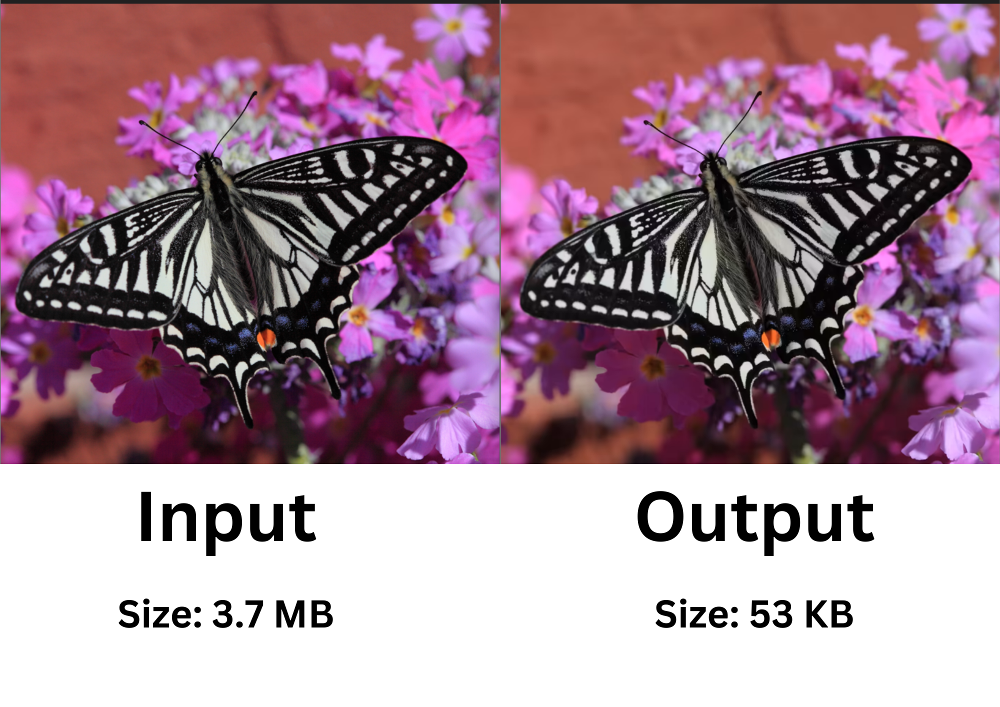
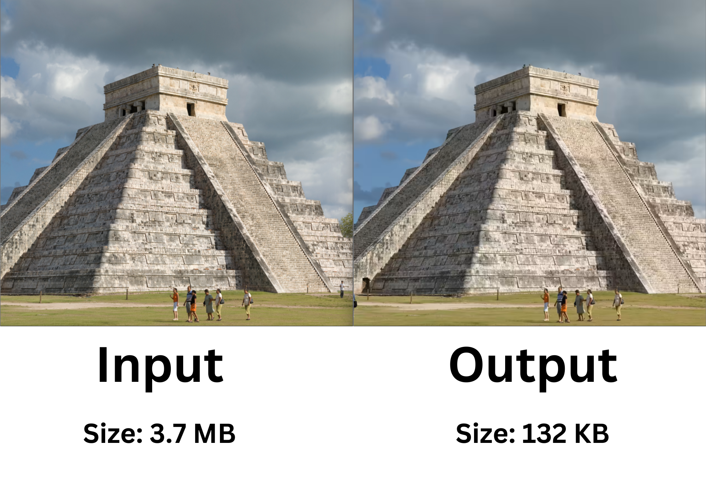

<div align="center">

# Remige - Forked Version of libSquoosh: Advanced Image Compression Framework for Superior File Size Reduction

<p id="intro">Remige is an advanced image compression framework, built as a fork of libSquoosh. By integrating Squoosh's powerful image codecs directly into JavaScript applications, Remige offers unparalleled compression performance and file size reduction. Designed for compatibility with the latest Node.js versions, Remige enhances image processing with modern features and optimized efficiency, making it the go-to solution for developers seeking top-tier image optimization.</p>

### Supported Platforms

[]()
[]()
[]()

---

<p>

<span>
  <a href="https://github.com/darsan-in/Remige/commits/main">
    
  </a>
</span>

<span>
  <a href="">
    
  </a>
</span>

</p>

---

<p>

<span>
  <a href="LICENSE">
    
  </a>
</span>

<span>
  <a href="https://github.com/darsan-in/Remige/releases">
    
  </a>
</span>

</p>

<p>

<span>
  <a href="https://www.codefactor.io/repository/github/darsan-in/Remige/issues/main">
    
  </a>
</span>

</p>

---

<p>

<span>
  <a href="">
    
  </a>
</span>

<span>
  <a href="">
    
  </a>
</span>

</p>

---

<p>

<span>
  <a href="https://github.com/sponsors/darsan-in">
    
  </a>
</span>

</p>

---

</div>

## Table of Contents 📝

- [Features and Benefits](#features-and-benefits-)
- [Use Cases](#use-cases-)
- [Friendly request to users](#-friendly-request-to-users)

- [Installation - Step-by-Step Guide](#installation---step-by-step-guide-)
- [Usage](#usage)
- [In-Action](#in-action-)

- [License](#license-%EF%B8%8F)
- [Contributing to Our Project](#contributing-to-our-project-)
- [Website](#website-)

- [Contact Information](#contact-information)
- [Credits](#credits-)

## Features and Benefits ✨

- **Node.js Compatibility**: Supports the latest Node.js versions, ensuring modern development compatibility.
- **Direct Codec Integration**: Integrates Squoosh's image codecs directly within JavaScript applications.
- **Optimized Performance**: Tailored for optimal performance in current development practices.
- **ImagePool for Efficiency**: Efficiently manages parallel image processing through `ImagePool`.
- **Auto Optimizer**: Includes an experimental auto optimizer for streamlined image compression.

## Use Cases ✅

- **Web Development**: Use Remige for compressing images in web applications, ensuring faster load times.
- **Node.js Applications**: Integrate Remige into Node.js projects for high-performance image processing.
- **Batch Processing**: Manage and process large batches of images efficiently with `ImagePool`.
- **Image Preprocessing**: Resize and preprocess images before encoding for various formats.
- **Automated Workflows**: Use Remige in CI/CD pipelines for automatic image optimization.

---

### 🙏🏻 Friendly Request to Users

Every star on this repository is a sign of encouragement, a vote of confidence, and a reminder that our work is making a difference. If this project has brought value to you, even in the smallest way, **please consider showing your support by giving it a star.** ⭐

_"Star" button located at the top-right of the page, near the repository name._

Your star isn’t just a digital icon—it’s a beacon that tells us we're on the right path, that our efforts are appreciated, and that this work matters. It fuels our passion and drives us to keep improving, building, and sharing.

If you believe in what we’re doing, **please share this project with others who might find it helpful.** Together, we can create something truly meaningful.

Thank you for being part of this journey. Your support means the world to us. 🌍💖

---

## Installation - Step-by-Step Guide 🪜

- **Step 1:** Install Remige in your local project with:

```bash
$ npm install remige
```

- **Step 2:** To use Remige, import `ImagePool` and set up your image processing pipeline:

```javascript
import { ImagePool } from "remige";
import { cpus } from "os";

const imagePool = new ImagePool(cpus().length);
```

Ensure to only create one `ImagePool` instance to avoid memory issues during parallel image processing.

## Usage

All API remains same as [@squoosh/lib](https://www.npmjs.com/package/@squoosh/lib)

#### Ingesting Images

Ingest images using `imagePool.ingestImage()`, accepting `ArrayBuffer` from `fs.readFile()` or `fetch()`.

```javascript
import fs from "fs/promises";

const file = await fs.readFile("./path/to/image.png");
const image = imagePool.ingestImage(file);
```

#### Preprocessing and Encoding Images

Preprocess and encode images to various formats:

```javascript
const preprocessOptions = {
  resize: {
    width: 100,
    height: 50,
  },
};

await image.preprocess(preprocessOptions);

const encodeOptions = {
  mozjpeg: {}, // default settings
  jxl: {
    quality: 90,
  },
};

const result = await image.encode(encodeOptions);
```

#### Closing ImagePool

Close the `ImagePool` pipeline to prevent ingesting and encoding new images:

```javascript
await imagePool.close();
```

#### Writing Encoded Images to File System

Write encoded images to the file system:

```javascript
const rawEncodedImage = image.encodedWith.mozjpeg.binary;

await fs.writeFile("/path/to/new/image.jpg", rawEncodedImage);
```

#### Extracting Image Information

Extract decoded and encoded image information:

```javascript
console.log(await image.decoded);
console.log(image.encodedWith.jxl);
```

#### Auto Optimizer

Remige includes an experimental auto optimizer:

```javascript
const encodeOptions = {
  mozjpeg: "auto",
};
```

## In-Action 🤺

Identical Images but Different Size: Magic of Remige






## License ©️

This project is licensed under the [Apache License 2.0](LICENSE).

## Contributing to Our Project 🤝

We’re always open to contributions and fixing issues—your help makes this project better for everyone.

If you encounter any errors or issues, please don’t hesitate to [raise an issue](../../issues/new). This ensures we can address problems quickly and improve the project.

For those who want to contribute, we kindly ask you to review our [Contribution Guidelines](CONTRIBUTING) before getting started. This helps ensure that all contributions align with the project's direction and comply with our existing [license](LICENSE).

We deeply appreciate everyone who contributes or raises issues—your efforts are crucial to building a stronger community. Together, we can create something truly impactful.

Thank you for being part of this journey!

## Website 🌐

<a id="url" href="https://squoosh.app/">squoosh.app</a>

## Contact Information

For any questions, please reach out via hello@darsan.in or [LinkedIn](https://www.linkedin.com/in/darsan-in/).

## Credits 🙏🏻

Remige is a forked version of [libSquoosh](https://github.com/GoogleChromeLabs/squoosh), originally developed and maintained by the [GoogleChromeLabs](https://github.com/GoogleChromeLabs). We credit the Squoosh team for their foundational work and contributions to image compression technology.

---

<p align="center">

<span>
<a href="https://www.linkedin.com/in/darsan-in/"></a>
</span>

<span>
  
</span>

<span>
<a href="https://www.youtube.com/@darsan-in"></a>
</span>

<span>
  
</span>

<span>
<a href="https://www.facebook.com/darsan.in/"></a>
</span>

<span>
  
</span>

<span>
<a href="https://www.npmjs.com/~darsan.in"></a>
</span>

<span>
  
</span>

<span>
<a href="https://github.com/darsan-in"></a>
</span>

<span>
  
</span>

<span>
<a href="https://huggingface.co/darsan"></a>
</span>

<span>
  
</span>

<span>
<a href="https://www.reddit.com/user/iamspdarsan/"></a>
</span>

<span>
  
</span>

<span>
<a href="https://darsan.in/"></a>
</span>

<p>

---

#### Topics

<ul id="keywords">
<li>image compression</li>
<li>Node.js library</li>
<li>JavaScript codecs</li>
<li>image optimization</li>
<li>Squoosh fork</li>
<li>modern development</li>
<li>parallel processing</li>
<li>image encoding</li>
<li>image resizing</li>
<li>web development</li>
<li>batch processing</li>
<li>auto optimizer</li>
<li>Node.js integration</li>
<li>CI/CD pipelines</li>
<li>performance enhancement</li>
<li>image preprocessing</li>
<li>high-performance tools</li>
<li>open-source projects</li>
<li>image processing pipeline</li>
<li>memory management</li>
</ul>
